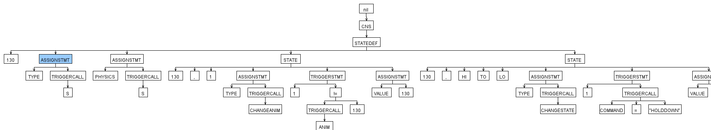
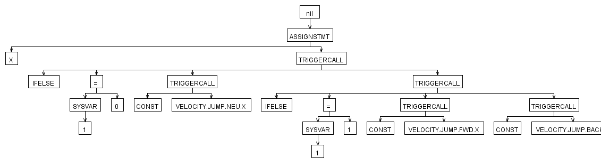
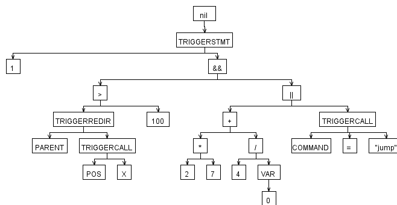
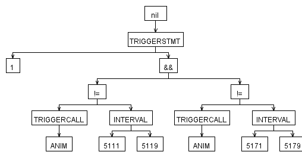

# Sourcy — CNS → Lua / C++ Compiler

> **Legacy code, circa 2012.** I wrote this as part of a [MUGEN](https://en.wikipedia.org/wiki/Mugen_(game_engine)) clone I was building back then.
> The MUGEN engine drives characters with a scripting format called **CNS** (Character States) plus **CMD** (Command/Input) files. Sourcy parses those files and emits either **Lua** (for a scripted runtime) or **C++** (for a compiled runtime), selected at the command line.
>
> This is being revived from a Visual Studio 2008 project. The original code has been upgraded to build on modern compilers, the grammars, and the architecture are unchanged. The build system is new.

---

## What it does

```
compile  krono.cns krono2.cns krono3.cns krono.cmd  --output LUA   --entityname krono
compile  krono.cns krono2.cns krono3.cns krono.cmd  --output CPP   --entityname krono
```

Given one or more `.cns` / `.cmd` files describing a MUGEN-style character, Sourcy emits a set of files in the target language. With `--output LUA` (the default), you get a per-file Lua module plus a master file that wires them together:

```
crono.lua          ← state blocks from krono.cns
crono2.lua         ← state blocks from krono2.cns
crono3.lua         ← state blocks from krono3.cns
cronocmd.lua       ← command definitions from krono.cmd
cronomain.lua      ← entry point: require()s the other files
```

With `--output CPP`, the same conceptual structure is emitted as C++ — one source/header pair per input file plus a master entry point. The result is meant to be compiled into a runtime that doesn't embed a Lua VM, trading flexibility (no hot-reloading) for raw speed.

In both cases each character state in CNS becomes a function on the character object (e.g. `crono:state100()` in Lua, `crono::state100()` in C++), and the host runtime ticks the state machine on every frame.

A worked example of the input → output translation lives in [`compilerinfo.txt`](./compilerinfo.txt).

---

## Prerequisites

| Tool | Why |
|------|-----|
| **CMake ≥ 3.16** | Build system |
| **A C/C++ compiler** | MSVC, Clang, or GCC. C99 + C++11 |
| **Java (JRE/JDK)** | To run the ANTLR 3.4 code generator at build time |

The ANTLR 3.4 jar and the libantlr3c C runtime source are vendored under [`third_party/antlr3/`](./third_party/), so you don't need to install ANTLR or its C runtime separately. On MSVC the build picks up the prebuilt `.lib`; on macOS / Linux / MinGW it compiles libantlr3c from source.

---

## Build

```bash
cmake -S . -B build
cmake --build build
```

Override the deps location if needed:

```bash
cmake -S . -B build \
    -DDEPS_DIR=/path/to/deps/antlr3 \
    -DANTLR3_JAR=/path/to/antlr-3.4-complete.jar
```

The executable lands at `build/compile` (or `build/Debug/compile.exe` on multi-config generators).

---

## Architecture

Sourcy is structured as a **pipeline of stages** that pass an AST between them. Every stage implements a `PipelineStage` interface and is composed into a `Pipeline`. There is a fixed front-end and one of several **interchangeable back-ends**, picked at runtime via `--output`:

```
                ┌────────────────────────── FRONT-END (fixed) ──────────────────────────┐
input files ──► │  parser (ANTLR3 lexer+parser)  ──►  AST  ──►  semantic check  ──►  AST │
                └───────────────────────────────────────────────────────────────────────┘
                                                  │
                                                  ▼
                  ┌─────────── BACK-END (selected by --output) ───────────┐
                  │                                                       │
                  │   AST ──► Lua code gen ──► code blocks ──► .lua files │
                  │   AST ──► C++ code gen ──► code blocks ──► .cpp / .h  │
                  │                                                       │
                  └───────────────────────────────────────────────────────┘
```

Conceptually that maps to the source tree like this:

| Stage                                  | Class / File |
|----------------------------------------|--------------|
| File → AST                              | `CNSFileToAST` |
| AST semantic & error check              | `CNSCheckStage` (`CNSCheckSemanticActions.cpp`) |
| AST → Lua intermediate code blocks      | `CNSASTToLUAStage` (`LUAGenSemanticActions.cpp`) |
| AST → C++ intermediate code blocks      | `CNSASTToCPPStage` (`CPPGenSemanticActions.cpp`) |
| Lua file emission                       | `LUAPostGenerator` |
| C++ file emission                       | `CPPPostGenerator` |
| Pipeline plumbing                       | `Pipeline`, `PipelineStage`, `CNSFrontEndPipeline`, `LUABackEndPipeline`, `CPPBackEndPipeline` |

### Grammars (ANTLR 3)

The lexers, parsers, and tree walkers are written in [ANTLR 3](https://www.antlr3.org/). At build time, CMake invokes `java -cp antlr-3.4-complete.jar org.antlr.Tool` over five grammar files (under `Grammars/`) which emit C code into `build/generated/`:

| Grammar       | Kind                  | Produces                            | Purpose |
|---------------|-----------------------|-------------------------------------|---------|
| `def.g`       | Combined lexer+parser | `defLexer.{c,h}`, `defParser.{c,h}` | Tokens shared across CNS — pulled in via `tokenVocab` |
| `cns.g`       | Combined lexer+parser | `cnsLexer.{c,h}`, `cnsParser.{c,h}` | CNS source → AST |
| `cnscheck.g`  | Tree parser           | `cnscheck.{c,h}`                    | Walks the AST to validate semantics, emit errors |
| `luagen.g`    | Tree parser           | `luagen.{c,h}`                      | Walks the AST and emits Lua |
| `cppgen.g`    | Tree parser           | `cppgen.{c,h}`                      | Walks the AST and emits C++ |

The dependency chain matters: `cns.g` imports tokens from `def.g`, and the three tree parsers (`cnscheck`, `luagen`, `cppgen`) all import tokens from `cns.g`. The CMake build models that explicitly via `cns.tokens` / `def.tokens` as build artifacts.

### From characters to state machines

A CNS file is essentially a list of **state blocks**. Each block has a numeric ID and a body containing controllers (`PlaySnd`, `ChangeState`, `HitDef`, …) gated by triggers (`triggerall`, `trigger1`, `trigger2`, …). The compiler emits one Lua function per state block, with controllers translated to function calls and triggers to chained boolean expressions:

#### Original CNS
```ini
[Statedef 1013]
type    = S
movetype= A
physics = N
ctrl = 0

[State 0, PosAdd]
type = PosAdd
trigger1 =time = 0
x= -20
y = 10

[State 203, HitDef]
type = HitDef
trigger1 = time = 0    ;Activate at time = 0 (start of state)
attr = S, NA           ;Attributes of the HitDef (explained later)
damage = 50            ;Damage points to deal
guardflag = MA
pausetime = 0,10

hitsound = S21,ifelse(random>499,1,0)
guardsound = 6,0

sparkxy = -10,-20
animtype = hard
ground.type = High
ground.slidetime = 5
ground.hittime  = 12
ground.velocity = 0
air.velocity = 0,-4
```
#### --output LUA
```lua
function Cloudi:state_1013()
    -- State initialization
    self:setStateParams
    {
        stateType = "S",
        moveType = "A",
        physics = "N",
        ctrl = 0,
    }

    -- State controller
    if ((self:time()) == 0) then
        self:posAdd {
            x = -20,
            y = 10
        }
    end

    -- State controller
    if ((self:time()) == 0) then
        self:hitDef {
            attr = {"S", "NA"},
            damage = 50,
            guardFlag = "MA",
            pauseTime = {0, 10},
            hitSound = {{"S", 21}, (self:ifElse(((self:random()) > 499), 1, 0))},
            guardSound = {6, 0},
            sparkXY = {-10, -20},
            animType = "hard",
            ground_type = "High",
            ground_slideTime = 5,
            ground_hitTime = 12,
            ground_velocity = 0,
            air_velocity = {0, -4}
        }
    end
end
```
#### --output CPP
```c++
void Cloudi::state_1013()
{
	// State initialization
	if(time().GetInt32() == 0) {
		setStateParams_data params;
		params.stateType = 'S';
		params.moveType = 'A';
		params.physics = 'N';
		params.ctrl = 0;
		setStateParams(params);
	}
		
	// State controller
	if (((time()) == 0) ) {
		posAdd_data d;
		d.x = -20;
		d.y = 10;
		posAdd(d);
	}
	
	// State controller
	if (((time()) == 0) ) {
		hitDef_data d;
		d.attr = {"S", "NA"};
		d.damage = 50;
		d.guardFlag = "MA";
		d.pauseTime = {0, 10};
		d.hitSound = {{"S", 21}, (ifElse(((random()) > 499), 1, 0))};
		d.guardSound = {6, 0};
		d.sparkXY = {-10, -20};
		d.animType = "hard";
		d.ground_type = "High";
		d.ground_slideTime = 5;
		d.ground_hitTime = 12;
		d.ground_velocity = 0;
		d.air_velocity = {0, -4};
		hitDef(d);
	}
}
```

A "master" file (*_master.{.lua,.cpp}) is also generated gluing it all together, including but not limited to: the character's metadata, button remaps, a list of related files, ... See [`tests/lua/Cloudi_master.lua`](tests/lua/Cloudi_master.lua) or [`tests/lua/Cloudi_master.cpp`](tests/lua/Cloudi_master.cpp).    

The runtime (not in this repo) provides the `FightActor` superclass, the per-frame `onTick` / `onRender` loop, input handling, collision/hit boxes, and the controller / trigger primitives that the generated code calls into. Two runtimes exist conceptually:

- **Lua runtime** — loads the `*.lua` files via `require`, dispatches state functions per tick. Cheap to iterate on, supports hot reload.
- **C++ runtime** — links against the generated `*.cpp` / `*.h` directly, eliminating the script VM at the cost of needing a full rebuild on every character change.

The compiler is the same up to the back-end; only the emission stage differs.

The semantic checker enforces things like **no duplicate state IDs across input files** — that's why multi-file inputs are passed in a single invocation rather than compiled independently.

---

## AST examples

These are real ASTs produced by the front-end during development (rendered to PNG via ANTLR's debug output). They give you a feel for what the parser is doing before code generation kicks in.

### Full state-def block

A complete `[StateDef N]` block with `[State N]` controllers underneath.

```
[STATEDEF 130]
TYPE = S
PHYSICS = S

[STATE 1]
TYPE = CHANGEANIM
TRIGGER1 = ANIM=130
VALUE = 130
[STATE 2]
TYPE = CHANGESTATE
TRIGGER1 = COMMAND="HOLDDOWN"
...

```



### Expression parsing

How MUGEN trigger expressions get parsed — operator precedence, function calls, comparisons.
```
X = IFELSE(SYSVAR(1) = 0, CONST(VELOCITY.JUMP.NEU.X), IFELSE(SYSVAR(1) = 1, CONST(VELOCITY.JUMP.FWD.X), CONST(VELOCITY.JUMP.BACK.X)))
```


### Nesting
Nested control structures and how triggers chain.



### Intervals

Interval / range trigger expressions (e.g. `time = [0, 10]`).



A larger CNS corpus used during development is in [`tests/cns`](tests/cns).

---

## Project layout

```
compile/
├── CMakeLists.txt            ← cross-platform build
├── main.cpp                  ← entry point, arg parsing, pipeline wiring
├── Pipeline*.{cpp,h}         ← pipeline / stage abstractions
├── CNS*.{cpp,h}              ← front-end stages (parse, check)
├── LUA*.{cpp,h}              ← Lua back-end stages (codegen, post-gen)
├── CPP*.{cpp,h}              ← C++ back-end stages (codegen, post-gen)
├── *SemanticActions.{cpp,h}  ← semantic-action helpers used by the ANTLR grammars
├── antlr3customtokenstream.* ← custom token stream used by the front-end
├── Grammars/
│   ├── def.g
│   ├── cns.g
│   ├── cnscheck.g
│   ├── luagen.g              ← Lua back-end tree walker
│   └── cppgen.g              ← C++ back-end tree walker
├── third_party/
│   └── antlr3/               ← vendored ANTLR 3.4 jar + libantlr3c source (BSD-3)
├── tests/                    ← sample inputs and AST screenshots
└── compilerinfo.txt          ← original design notes (2012)
```

---

## Caveats

- Code from 2012, originally targeting **Visual Studio 2008 + Win32**. Expect warnings on modern Clang/GCC — the CMakeLists silences the worst offenders (`-Wno-pointer-sign`, `-Wno-incompatible-pointer-types`, `-fpermissive`) without "fixing" anything.
- The bundled `antlr3config.h` shipped with libantlr3c-3.4 is regenerated at configure time from CMake's own `check_include_file` probes, because the vendored copy assumed Linux (`malloc.h` is not a thing on macOS).
- The runtimes that consume the generated Lua or C++ are **not** in this directory — this repo is only the compiler.

---

## Code quality notes

This is **preserved 2012 C++**, not a continuously maintained codebase. The goal of bringing it back was to make it build and run on modern toolchains, not to modernize the source. Treat the contents as a historical snapshot, with a few specific notes for any reader who wants to understand the trade-offs:

- **Global state in semantic actions.** Files like `CNSSemanticActions.cpp`, `CNSCheckSemanticActions.cpp` and `LUAGenSemanticActions.cpp` hold per-walk state in file-scope variables (`pCurController*`, `pCurCodeBlock`, …). This is **inherent to ANTLR 3 with C actions**: grammar callbacks are free functions with no context pointer, so per-walk state has to live somewhere accessible. The compiler runs single-threaded, so this is correct — just not thread-safe. Modern ANTLR 4 grammars don't need this pattern.
- **Raw `new` / `delete` in the pipeline.** `Pipeline` owns its stages via raw pointers and frees them in its destructor. Pre-`unique_ptr` style; functionally fine, idiomatically out of date.
- **`CNSSemantics.cpp` is large (≈8.4k lines).** It is almost entirely a **table of controller / trigger signatures**, not behavior. Conceptually it's a data file disguised as a translation unit. Splitting it would be cosmetic.
- **Tree parser interfaces via `dynamic_cast`.** `Pipeline` uses `dynamic_cast` between `PipelineStage` and the `InputXxx` / `OutputXxx` interfaces. Functionally correct multi-interface composition; today it would be designed with templates or `std::variant` over a state-type tag.
- **Argument parser is permissive.** Bad numeric input falls through `atoi` without error reporting. Tolerable for a tool you invoke yourself; not how you'd write a library.
- **What `--clean-build` would look like.** Were this still an active project, the modernization path would be: `std::unique_ptr` for stage ownership, `std::filesystem::path` for path handling, an explicit walker context struct to replace the file-scope semantic-action globals, and ANTLR 4 to retire the C/C++ interop boundary. None of that is in scope for an archival release.

If you're looking for a model of modern C++ design, **this is not it**. If you're looking for a working ANTLR-3 compiler front-end with a clean pipeline architecture, it's a reasonable starting point.

---

## License

Released under the [MIT License](./LICENSE). Copyright (c) 2012-2026 Miguel Angel Exposito Sanchez (radexx).

You can use, modify, and redistribute this code — including in closed-source derivative products — **as long as the copyright notice and license text are preserved** in the distribution.

### Trademarks

"MUGEN" is a trademark of Elecbyte. This project is unaffiliated with and not endorsed by Elecbyte. It only consumes the CNS/CMD text formats, which are interoperability descriptions and not copyrighted artifacts.

### Third-party components

This project links against [libantlr3c](https://www.antlr3.org/) 3.4 and uses the ANTLR 3.4 code generator, both distributed under the BSD 3-Clause license. Their copyright notices apply to the generated and runtime code.
